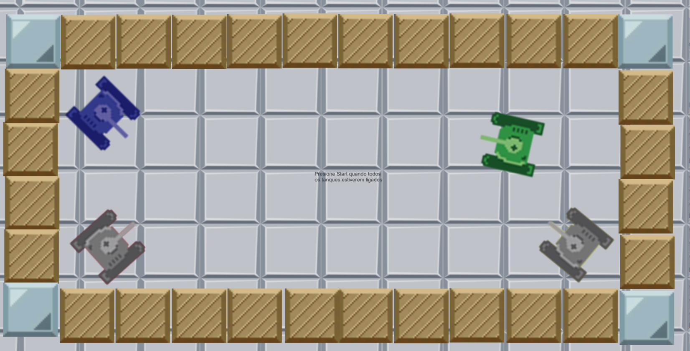
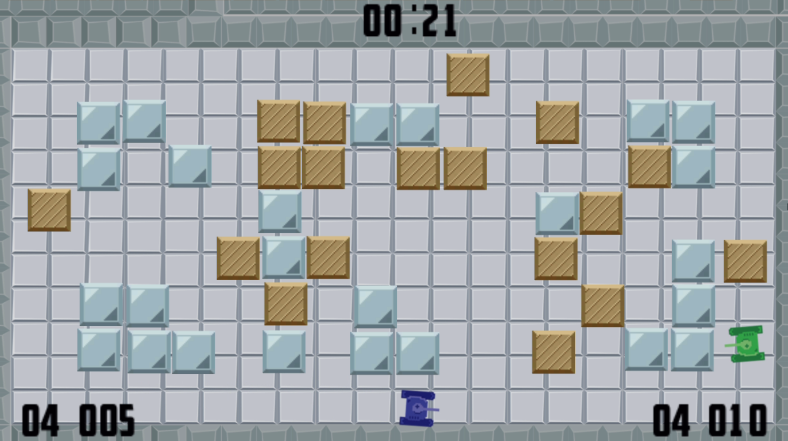
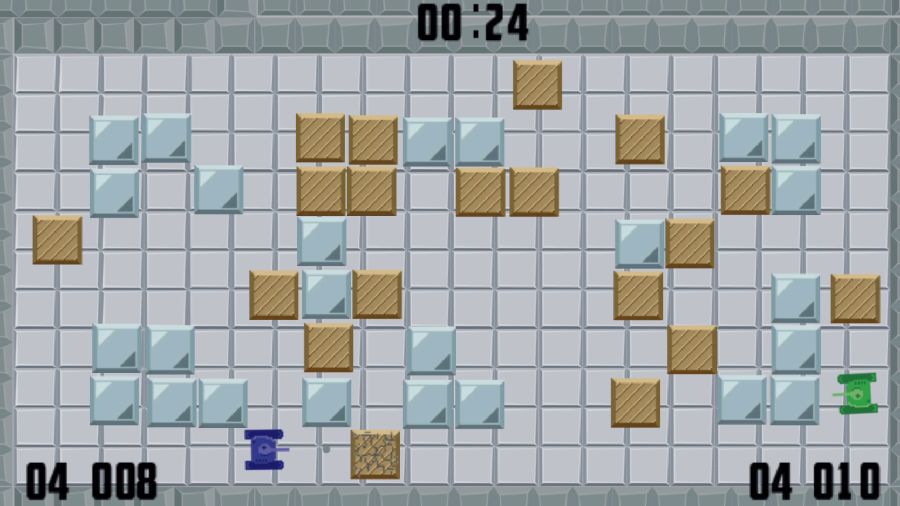

# tanque_game

This game was originally developed as a homework, all the code ware write by me with some help from internet and the assets were provided by [@SergioPinheiro](https://github.com/SergioPinheiro)

# Rules

* To play this game is necessary at least 2 players and at most 4 players, you'll also need joysticks
* The objective is to shoot the other players as much as you can and avoid dying
* The player who shoots other players more often wins
* This is a Couch Game thus there is only local multiplayer :)

